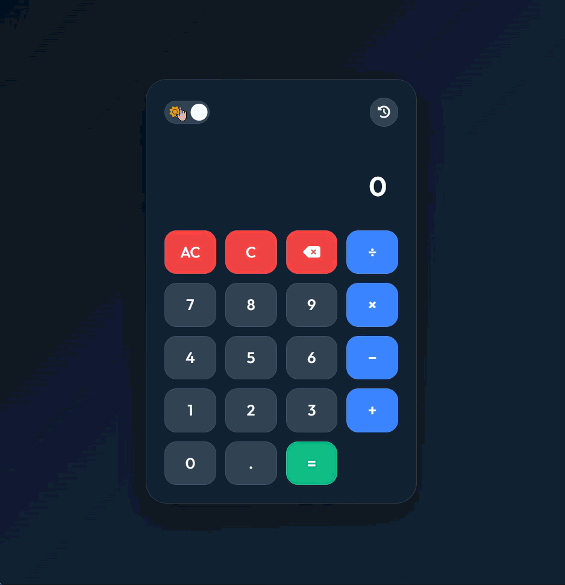
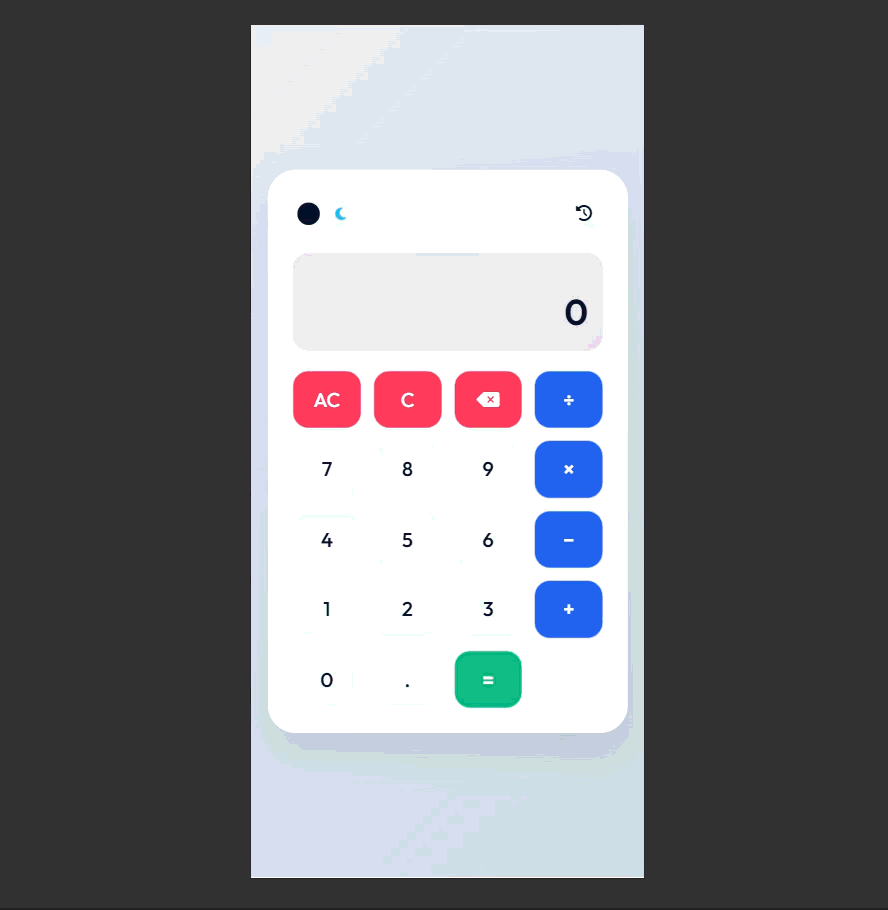

# Animated Smart Calculator

A modern and interactive calculator web application built using HTML, CSS, and JavaScript. This project is designed to provide an elegant and user-friendly experience while covering essential front-end development concepts such as UI design, DOM manipulation, event handling, calculation logic, theming, and data persistence.

The calculator is not just a simple math tool — it also includes a dark/light theme switch, animated feedback, a history panel, keyboard support, and responsive styling for both desktop and mobile screens.

## Table of Contents

- [Project Overview](#project-overview)
- [Features](#features)
- [Technology Stack](#technology-stack)
- [Project Structure](#project-structure)
- [Installation](#installation)
- [Usage](#usage)
- [Screenshots and Demo GIFs](#screenshots-and-demo-gifs)
- [Core Functionalities](#core-functionalities)
- [Code Structure Explanation](#code-structure-explanation)
- [How It Works](#how-it-works)
- [Example Scenarios](#example-scenarios)
- [Future Enhancements](#future-enhancements)
- [License](#license)

## Project Overview

This front-end application allows users to perform arithmetic operations quickly and effectively. It includes a visually polished calculator interface and a set of interactive features that make the application feel more advanced and modern than a standard calculator.

The design emphasizes:

- Minimal clutter
- Smooth visual transitions
- Accessible button layout
- Responsive sizing
- Personalized theme control
- Persistent user data through LocalStorage

The project is organized using modular JavaScript files to separate responsibilities. This makes the app easier to read, modify, and extend.

## Features

### Core Calculator Features
- Addition
- Subtraction
- Multiplication
- Division
- Decimal input support
- Clear current entry
- Clear all
- Backspace functionality
- Instant result display

### Interface & Visual Features
- Clean and responsive layout
- Modern styling with soft shadows and glassmorphism-inspired accents
- Animated button presses
- Smooth result display transitions
- Hover effects for interactive feedback
- Light and dark theme switch

### History & Utility Features
- Tracks previous calculations
- Stores recent results in browser LocalStorage
- Displays a small history preview
- Opens a full modal with all stored records
- Allows users to clear history

### Accessibility & Usability
- Keyboard support for quick input
- Responsive control sizes on small screens
- Clear visual separation between operators, actions, and numbers

## Technology Stack

- HTML5
- CSS3
- JavaScript
- Font Awesome
- Google Fonts
- LocalStorage API

## Project Structure

```text
Task-2_CodeAlpha_Calculator-App/
├── index.html
├── assets/
│   ├── css/
│   │   ├── animations.css
│   │   └── style.css
│   ├── js/
│   │   ├── app.js
│   │   ├── Calculator.js
│   │   ├── HistoryManager.js
│   │   └── ThemeManager.js
│   └── gifs/
│       ├── desktop-demo.gif
│       └── mobile-demo.gif
├── README.md
└── .gitignore
```

## Installation

### Prerequisites
- A modern web browser
- VS Code (recommended)
- Python (optional, for local server) or any static file server

### Steps

1. Download or clone the project.
2. Open the folder in VS Code.
3. Start a local server.

Using Python:

```bash
python -m http.server 8000
```

Then open:

```text
http://localhost:8000
```

Alternatively, you can open `index.html` directly in the browser.

## Usage

### Basic Calculator Flow
1. Click number buttons to enter values.
2. Select an arithmetic operator.
3. Enter the second value.
4. Click `=` to get the result.
5. Use `AC` to clear everything.
6. Use `C` to clear the current value.
7. Use the delete button to remove the last digit.

### Theme Switching
- Use the theme toggle located in the top bar
- It switches between dark mode and light mode
- The selected theme is saved in LocalStorage

### History
- Click the history icon/button
- View recent calculations
- Open the full history modal
- Clear stored history if needed

## Screenshots and Demo GIFs

### Desktop Demo GIF


> Desktop demo showing the calculator in full layout with smooth interactions and theme switching.

### Mobile Demo GIF


> Mobile demo showing the responsive layout and touch-friendly calculator controls.

### Desktop Static Screenshot


### Mobile Static Screenshot


> Add the actual GIF files in `assets/gifs/` and image files in `assets/screenshots/` to display them correctly in GitHub.

## Core Functionalities

### Calculator Logic
The calculator uses a state-based structure to handle current and previous values. It stores:

- current operand
- previous operand
- selected operator
- evaluation status

This allows operations to behave consistently and helps preserve the correct sequence of user inputs.

### Theme Management
The theme state is stored in `localStorage`, so the chosen mode remains active across reloads.

### History Management
History entries are stored as objects that include:

- expression
- result

This makes it easy to display previous calculations and reuse them in the UI.

## Code Structure Explanation

### index.html
This file defines the overall layout of the UI. It includes:

- Theme switch area
- Display section
- Calculator keypad
- History modal

1. Example:

```
html
<section class="display-section">
  <div class="expression-display" id="expression-display"></div>
  <div class="result-display" id="main-display">0</div>
</section>
```

This part is responsible for showing:

- the expression currently being evaluated
- the current or final result

### assets/js/Calculator.js
This file contains the main mathematical behavior.

2. Example:

```
js
appendNumber(number) {
  if (this.isEvaluated) {
    this.currentOperand = number === '.' ? '0.' : number;
    this.isEvaluated = false;
    return;
  }

  if (number === '.' && this.currentOperand.includes('.')) return;
  if (this.currentOperand === '0' && number !== '.') {
    this.currentOperand = number;
  } else {
    this.currentOperand += number;
  }
}
```

This ensures:
- numbers can be appended correctly
- decimals are handled safely
- repeated dots are prevented
- a new number starts clean after a previous result is shown

### assets/js/ThemeManager.js
This file deals with theme state and persistence.

3. Example:

```
js
applyTheme(theme) {
  document.documentElement.setAttribute('data-theme', theme);
  localStorage.setItem(this.storageKey, theme);
}
```

This updates the CSS variables and saves the user's selected theme to the browser storage.

### assets/js/HistoryManager.js
This file stores and renders all calculation history.

4. Example:

```
js
addRecord(record) {
  if (!record) return;
  this.history.unshift(record);
  if (this.history.length > 20) this.history.pop();
  this.save();
  this.render();
}
```

This logic:
- adds the newest item to the start of the array
- keeps a maximum number of entries
- saves to LocalStorage
- refreshes the UI

### assets/js/app.js
This is the main controller file that ties all modules together.

5. Example:

```
js
document.querySelector('.keypad').addEventListener('click', (e) => {
  const target = e.target.closest('button');
  if (!target) return;

  const { number, operator, action } = target.dataset;

  if (number !== undefined) {
    calc.appendNumber(number);
  }

  if (operator !== undefined) {
    calc.chooseOperation(operator);
  }

  if (action === 'all-clear') {
    calc.clearAll();
  }

  updateDisplay();
});
```

This file listens for user interaction and triggers the necessary calculator operations.

## How It Works

### 1. Input Handling
When a user presses a button, the application checks its type:

- Number
- Operator
- Action (clear, delete, equals)

Then it automatically updates the internal calculator state.

### 2. Arithmetic Execution
When the user presses `=`, the app performs the appropriate calculation using the stored previous and current operands.

Example:

```
js
switch (this.operation) {
  case '+':
    result = prev + current;
    break;
  case '-':
    result = prev - current;
    break;
  case '×':
    result = prev * current;
    break;
  case '÷':
    result = prev / current;
    break;
}
```

### 3. History Recording
After computing the result, the app stores the expression and result in history and displays the latest record.

### 4. Theme Persistence
The selected theme is applied to the root document and then stored in `localStorage`.

### 5. UI Updates
Every action triggers a UI refresh so the display and history stay synchronized with the state.

## Example Scenarios

### Example 1: Addition
Input:
```text
12 + 8
```

Output:
```text
20
```

### Example 2: Multiplication
Input:
```text
9 × 7
```

Output:
```text
63
```

### Example 3: Division
Input:
```text
100 ÷ 5
```

Output:
```text
20
```

### Example 4: Decimal Calculation
Input:
```text
3.5 + 2.25
```

Output:
```text
5.75
```

### Example 5: Theme Toggle
- User switches from dark mode to light mode
- The UI updates instantly
- Preference remains saved on refresh

## Responsive Design

The calculator is designed to work across multiple screen sizes. It uses flexible layout rules and adaptive spacing so the interface remains comfortable and visually balanced on desktop and mobile devices.

## Future Enhancements

Possible upgrades for this project include:

- Scientific calculator mode
- Percentage operator
- Parentheses support
- Square root and power functions
- Better error handling for invalid expressions
- More custom themes
- Improved accessibility for keyboard and screen readers
- History item selection to re-use prior expressions

## License

This project is intended for educational and personal use. It may be modified and extended as needed.

## Conclusion

This project demonstrates a complete front-end calculator implementation with a polished user experience and modular JavaScript architecture. It is a practical example of combining UI design, logic, basic data persistence, and responsive frontend development in a single, manageable project.

It is suitable for personal learning, portfolio display, and CodeAlpha task submission.